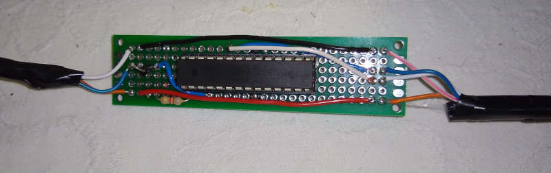
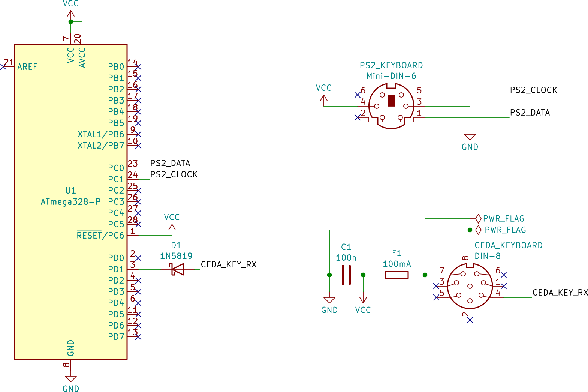

# ceda-keyboard

You have a Sanco 800x computer, but no keyboard? Worry no more, use this PS/2 to Sanco adapter!



## BOM
- Atmel Atmega 328P
- 1N5819 schottky diode
- male DIN-8 plug
- female mini-DIN-6 socket
- 100n capacitor (optional)
- 100mA fuse (optional)

## Schematics



## Flash
Hook your Atmega to the programmer, then:

```
make fuse
make flash
```

You may need to tweak the programmer settings a bit to match your configuration in the  `Makefile`.

## Resources
This repository is part of the [ceda](https://github.com/GLGPrograms/ceda-home) documentation project by [Retrofficina GLG](http//retrofficina.glgprograms.it/).
